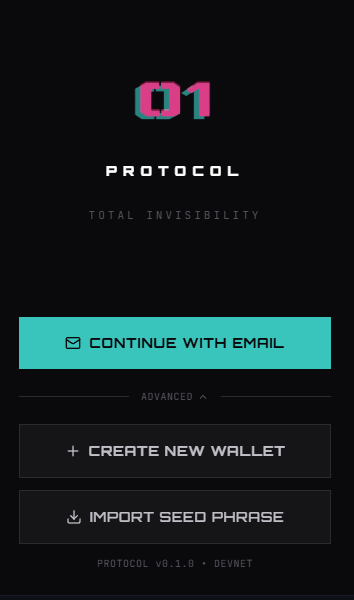
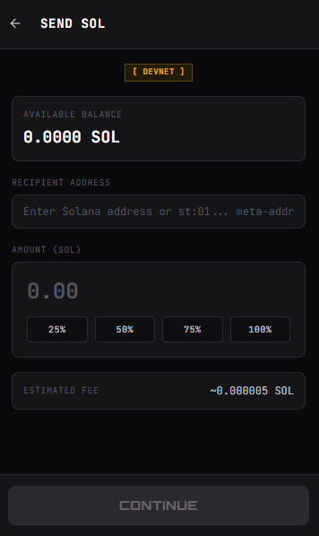
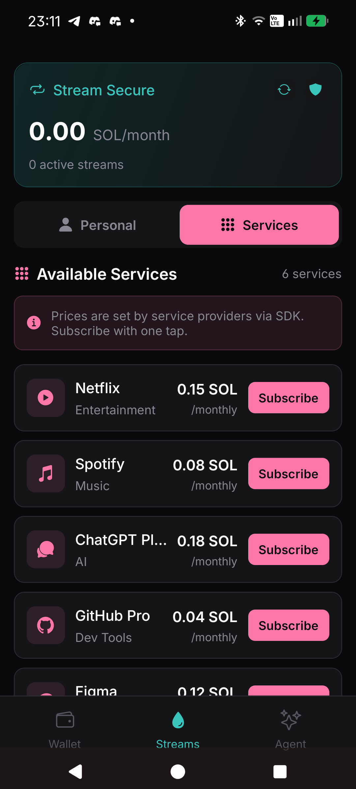
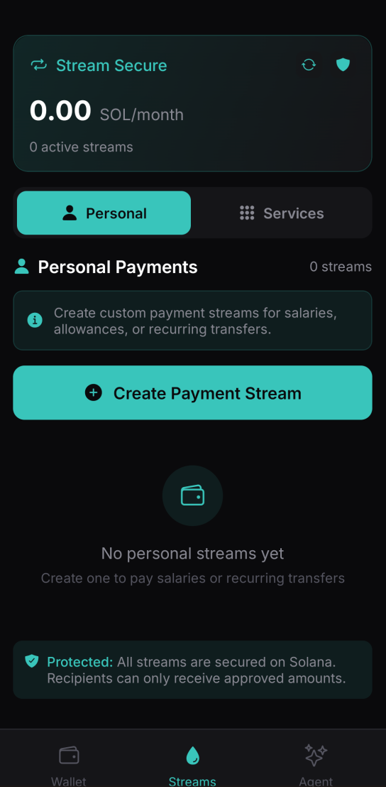
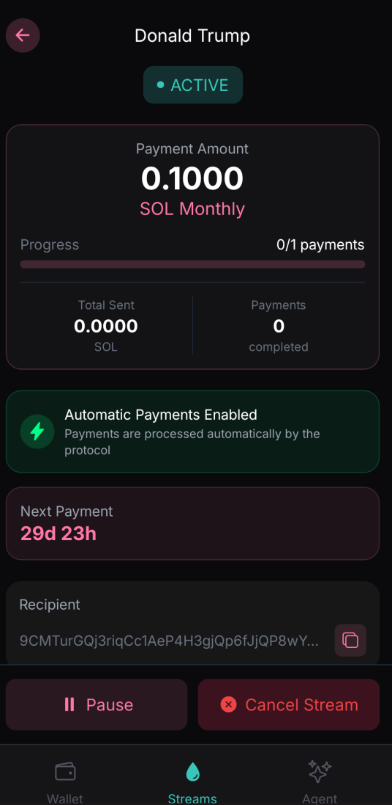

<p align="center">
  
</p>

<h1 align="center">Protocol 01</h1>

<p align="center">
  <strong>The privacy layer for Solana.</strong><br/>
  Zero-knowledge proofs &middot; Multi-party computation &middot; Confidential balances &middot; Stealth addresses &middot; Shielded transfers
</p>

<p align="center">
  <a href="https://protocol-01.vercel.app">Website</a> &middot;
  <a href="https://protocol-01.vercel.app/docs">Documentation</a> &middot;
  <a href="https://x.com/Protocol01_">Twitter/X</a> &middot;
  <a href="https://discord.gg/KfmhPFAHNH">Discord</a>
</p>

---

> **PROPRIETARY SOFTWARE &mdash; ALL RIGHTS RESERVED**
>
> &copy; 2025-2026 Volta Team | Developed by Slashy Fx
>
> This repository is publicly visible for **demonstration and evaluation purposes only**.
> Public visibility does **not** constitute a grant of any license.
> No permission is granted to use, copy, modify, fork, or distribute this code.
>
> For licensing, investment, or partnership inquiries &mdash; [reach out](https://x.com/Protocol01_).
>
> See [LICENSE](./LICENSE) for full terms.

---

## 📱 Installation & Demo

### Mobile App (Android)

**Download APK:** [Protocol-01 v0.8.2](https://github.com/IsSlashy/Protocol-01/releases/download/v0.8.2/protocol-01-v0.8.2.apk) (216 MB)

#### Installation Steps:
1. Download the APK on your Android device
2. Open the file → Allow "Install from unknown sources" if prompted
3. Tap "Install"
4. Open Protocol 01

#### First Launch:
1. Tap **"Create Wallet"** to generate a new wallet
2. **Save your seed phrase** (12 words) - this is your backup
3. Set up biometric authentication (optional)
4. You're ready to use P-01!


---

### Browser Extension (Chrome/Brave)

**Option 1 - Chrome Web Store:** *(Coming soon)*

**Option 2 - Manual Install (Developer Mode):**

1. Download the extension: [P01-Extension-v0.3.0.zip](https://github.com/IsSlashy/Protocol-01/releases/download/v0.8.0/P01-Extension-v0.3.0.zip)
2. Extract the ZIP file
3. Open Chrome → `chrome://extensions/`
4. Enable **"Developer mode"** (top right toggle)
5. Click **"Load unpacked"**
6. Select the extracted `dist` folder
7. Protocol 01 icon appears in your toolbar!

#### First Launch:
1. Click the P-01 icon in toolbar
2. **"Create Wallet"** or **"Import Wallet"**
3. Set a password to encrypt your wallet
4. Done!

<p align="center">
  
  
</p>

---

### 🎮 Demo Guide - Key Features

#### 1. Private Transfer (ZK Shielded)

Send crypto without anyone knowing who sent it or who received it.

| Step | Action |
|------|--------|
| 1 | Go to **"Privacy Zone"** or **"Shield"** |
| 2 | Deposit SOL into the shielded pool |
| 3 | Tap **"Private Send"** |
| 4 | Enter recipient address + amount |
| 5 | Confirm → ZK proof is generated |
| 6 | Transaction is completely private! |

#### 2. Confidential Balances (zkSPL)

Hide your token balance on-chain using quantum-resistant Poseidon commitments.

| Step | Action |
|------|--------|
| 1 | Go to **"Confidential"** from Privacy Zone |
| 2 | Deposit SOL into your confidential account |
| 3 | Your balance is now hidden on-chain as a Poseidon commitment |
| 4 | Send with **"Confidential Transfer"** — amount is hidden |
| 5 | Use **"Prove Balance"** to prove you have enough for DeFi |

#### 3. Payment Streams (Recurring Payments)

Set up automatic recurring payments with privacy.

| Step | Action |
|------|--------|
| 1 | Go to **"Streams"** tab |
| 2 | Tap **"Create Stream"** |
| 3 | Enter recipient, amount, frequency |
| 4 | Choose: Weekly / Bi-weekly / Monthly |
| 5 | Enable **"Private Mode"** for stealth payments |
| 6 | Confirm → Payments run automatically! |

<p align="center">
  
  
  
</p>

#### 4. Stealth Addresses

Receive payments to unique one-time addresses.

| Step | Action |
|------|--------|
| 1 | Go to **"Receive"** |
| 2 | Tap **"Generate Stealth Address"** |
| 3 | Share the address or QR code |
| 4 | Each address is unique and unlinkable! |

---

### 🔧 For Developers - Test on Devnet

```bash
# Get devnet SOL
solana airdrop 2 --url devnet

# Smart Contracts (Devnet)
ZK Shielded:      GbVM5yvetrSD194Hnn1BXnR56F8ZWNKnij7DoVP9j27c
zkSPL:            EqppogLBFqoVfYR2t6WVswaGo7cHxvWmgsgLDnaUPpah
Specter:          2tuztgD9RhdaBkiP79fHkrFbfWBX75v7UjSNN4ULfbSp
Subscription:     5kDjD9LSB1j8V6yKsZLC9NmnQ11PPvAY6Ryz4ucRC5Pt
Stream:           2yH26XmXwgPuHMvV1NbmgJin32rfP3msQt18W6168mws
Fee Splitter:     muCWm9ionWrwBavjsJudquiNSKzNEcTRm5XtKQMkWiD
Whitelist:        AjHD9r4VubPvxJapd5zztf1Yqym1QYiZaQ4SF5h3FPQE
P01 Arcium MPC:   FH1JiQRUhKP1ARqWw6P5aXsqhLt9DPfbg89gqLV2TLPT
Trustless:        FnTmMxsNx5yQ4nDxiUq7HKLyb6Hwi5Wb5D71Zu69i43Q
Relayer:          2okhzLVr6FEq5jP19KT6VurcSutx2zE4RhkRamrk5WpW
Quantum Vault:    HazoS6VKk4fqzjJg2yNYSPYTSq8yEHm2EZyb23seTh7o
Registry:         QaQwpvBi1EQpevNE21D2oNBHFsLtoLwa7aXH26zRhQB
STARK Verifier:   DGY37k3Jt7cbrfNa9rxyLZVcFB7S7A2NqtVpkh9fWQvs
```

---

## What is Protocol 01?

Protocol 01 is a privacy-first financial ecosystem on Solana.
It combines **Groth16 zero-knowledge proofs**, **Arcium decentralized MPC**, **ECDH stealth addresses**, and a **trustless on-chain relay** to deliver fully untraceable transactions.

P-01 couples ZK proofs with Arcium's multi-party computation network for threshold operations that ZK alone cannot handle — such as distributed key generation, private registry lookups, and encrypted governance votes. Where ZK proves correctness locally, MPC distributes trust across a decentralized cluster so no single node ever sees plaintext data.

Unlike mixers or tumblers, P-01 provides **cryptographic privacy** at the protocol level.
Amounts, senders, and recipients are hidden by default through ZK circuits and MPC protocols, not operational obfuscation.

```
User creates ZK proof (Groth16 / STARK)
    -> Proof submitted to on-chain trustless relayer
        -> Relayer verifies proof on-chain (Solana alt_bn128 / FRI)
            -> Funds sent to stealth address
                -> No on-chain link between sender and recipient
    (optional) MPC threshold decryption via Arcium Cerberus
```

---

## Architecture

```
protocol-01/
├── apps/
│   ├── extension/          # Chrome/Brave extension wallet (Manifest V3)
│   ├── mobile/             # React Native (Expo) mobile wallet
│   └── web/                # Next.js marketing site & SDK demo
├── packages/
│   ├── p01-js/             # @protocol-01/streams — Merchant integration (Protocol01 client)
│   ├── specter-sdk/        # @protocol-01/specter-sdk — Stealth wallets & transfers (P01Client)
│   ├── zk-sdk/             # @protocol-01/zk-sdk — ZK proof generation (ShieldedClient)
│   ├── zkspl-sdk/          # @protocol-01/zkspl-sdk — Confidential balances (ZkSplClient)
│   ├── arcium-sdk/         # @protocol-01/arcium-sdk — MPC confidential compute (6 use cases)
│   ├── auth-sdk/           # @protocol-01/auth-sdk — "Login with P-01" authentication
│   ├── whitelist-sdk/      # @protocol-01/whitelist-sdk — On-chain developer whitelist
│   ├── specter-js/         # @protocol-01/specter-js — Pay button & browser SDK
│   ├── rpc-config/          # @protocol-01/rpc-config — Shared RPC connection manager
│   ├── ui/                 # @protocol-01/ui — Shared design system & components
│   └── sdk/                # @protocol-01/streams — Payment stream utilities
├── circuits/
│   ├── transfer.circom              # Main ZK circuit (2-in-2-out, Merkle depth 20)
│   ├── confidential_balance.circom  # zkSPL balance commitment circuit (1,382 constraints)
│   ├── balance_proof.circom         # zkSPL balance sufficiency proof (644 constraints)
│   ├── denominated_pool.circom      # Fixed-denomination privacy pool (4,273 constraints)
│   ├── denominated_transfer.circom  # Denominated pool transfer circuit
│   ├── subscriber_ownership.circom  # Subscription ownership proof
│   ├── merkle.circom                # Merkle tree membership proof
│   └── poseidon.circom              # ZK-friendly hash function
├── programs/
│   ├── zk_shielded/        # Shielded pool — shield/transfer/unshield with Groth16 + STARK
│   ├── p01_zkspl/          # zkSPL — confidential balances with Poseidon commitments
│   ├── specter/            # Stealth address registry + private streams
│   ├── p01_arcium/         # MPC circuits — 9 Arcis circuits on Arcium network
│   ├── p01_trustless/      # On-chain trustless relayer (no backend server)
│   ├── p01_relayer/        # Relay instruction handlers + fee accounting
│   ├── p01_quantum_vault/  # Quantum-safe vault (WOTS+, hash-timelock, commit-reveal)
│   ├── p01_registry/       # Stealth meta-address directory (EIP-5564 style)
│   ├── p01_stark_verifier/ # On-chain STARK/FRI verifier (6 circuits, Goldilocks field)
│   ├── subscription/       # Recurring payments with delegated authority
│   ├── stream/             # Time-locked payment streaming (escrow)
│   ├── whitelist/          # Developer access control
│   └── p01-fee-splitter/   # Fee routing (0.5% protocol fee)
├── stark/                  # Winterfell STARK prover (Poseidon AIR, WASM bindings)
└── services/
    └── prover/             # Rust native Groth16 prover (ark-circom, ~50ms proofs)
```

---

## Privacy Stack

### Zero-Knowledge Proofs (Groth16)

Circuits written in **Circom**, proven with **snarkjs**.
Verified on-chain via Solana's native `alt_bn128` syscalls.

| Parameter | Value |
|-----------|-------|
| Proving system | Groth16 (BN254) |
| Hash function | Poseidon (ZK-native, ~300x fewer constraints than Keccak) |
| Merkle tree depth | 20 (~1M notes capacity) |
| Transfer model | 2-in-2-out (UTXO-style) |
| On-chain verification | ~200K compute units |

The circuit proves:
1. **Ownership** &mdash; Prover holds the spending key for input notes
2. **Membership** &mdash; Notes exist in the on-chain Merkle tree
3. **Nullifiers** &mdash; Prevents double-spending without revealing which note was spent
4. **Conservation** &mdash; Input amounts = output amounts + public amount

### Stealth Addresses (ECDH)

Adapted from Ethereum's EIP-5564 for Solana.
Each payment creates a **unique one-time address** using Elliptic Curve Diffie-Hellman key exchange.

```
Sender: ephemeralKey = random()
Shared secret = ECDH(ephemeralKey, recipientViewingKey)
Stealth address = recipientSpendingKey + H(sharedSecret) * G
```

The recipient scans incoming payments using a **viewTag** (2-byte fast filter).
Then derives the private key to spend.

### Shielded Pool

On-chain Anchor program.
Stores encrypted notes in a sparse Merkle tree.

| Instruction | Description |
|-------------|-------------|
| `shield` | Deposit transparent SOL/SPL into the pool |
| `transfer` | Private 2-in-2-out transfer within the pool |
| `transfer_via_relayer` | Gasless private transfer via relay |
| `unshield` | Withdraw from pool back to transparent balance |

### zkSPL — Confidential Token Balances (Quantum-Resistant)

Account-model privacy layer. Hides balances and transfer amounts on-chain using **Poseidon hash commitments** — a quantum-resistant alternative to ECC-based schemes like Pedersen.

```
Balance on-chain = Poseidon(balance, salt, owner_pubkey, token_mint)
                   ↑ nobody can reverse this without the salt
```

| Parameter | Value |
|-----------|-------|
| Commitment scheme | Poseidon hash (quantum-resistant, no ECC) |
| Circuit: balance update | `confidential_balance.circom` (1,382 constraints) |
| Circuit: sufficiency proof | `balance_proof.circom` (644 constraints) |
| Conservation law | `old_balance + credit === new_balance + debit` |
| DeFi composable | Yes — `proveBalance(threshold)` without revealing balance |

**Operations:**
- **Deposit** — SPL tokens into confidential account (amount public, balance hidden)
- **Withdraw** — From confidential back to transparent (amount public, remaining hidden)
- **Confidential Transfer** — Private send to another user (amount hidden as `Poseidon(amount, salt)`)
- **Balance Proof** — Prove `balance >= threshold` for DeFi without revealing actual balance

**Why quantum-resistant?**
Pedersen commitments (`C = v·G + r·H`) rely on elliptic curves — broken by Shor's algorithm.
Poseidon commitments (`C = Hash(v, r, ...)`) rely on algebraic hashes — immune to quantum attacks.
The Groth16 proof system is ephemeral and can be migrated to STARKs later.

### STARK Proofs (Quantum-Resistant)

On-chain STARK/FRI verifier for post-quantum privacy. Built with Winterfell, Goldilocks field (`2^64 - 2^32 + 1`), and Poseidon AIR constraints.

| Parameter | Value |
|-----------|-------|
| Proving system | STARK (FRI-based, no trusted setup) |
| Field | Goldilocks (`p = 2^64 - 2^32 + 1`) |
| Hash function | Poseidon (full S-box x^7, 30 rounds) |
| Proof size | ~9 KB (Blake3 Merkle, 16 queries) |
| On-chain verification | ~889K compute units |
| Circuits | 6 (subscriber, pool, balance, merkle, confidential_balance, transfer) |

STARKs complement Groth16 as a quantum-resistant alternative. Hash-based proofs (no elliptic curves) are immune to Shor's algorithm. The on-chain FRI verifier runs natively on Solana with no external dependencies.

### Private Relay (On-Chain Trustless)

The on-chain trustless relayer breaks the link between sender and recipient without any backend server:

1. User generates a ZK proof client-side (Groth16 or STARK)
2. User submits the proof + encrypted note to the `p01_trustless` program
3. The program verifies the proof on-chain (Solana `alt_bn128` syscalls or FRI verifier)
4. Funds are routed to the stealth address via the `p01_relayer` program
5. On-chain: only `Relayer PDA -> Stealth Address` is visible

No backend server, no trust assumptions. The relayer is a Solana program.

### Multi-Party Computation (Arcium MPC)

Decentralized MPC via Arcium's **Cerberus protocol** — as long as 1 honest node exists in the cluster, security holds. 9 Arcis circuits deployed on the Arcium network handle threshold operations that ZK proofs alone cannot cover.

| Parameter | Value |
|-----------|-------|
| MPC Network | Arcium (Cerberus protocol) |
| Circuits | 9 (relay, lookup, nullifier, audit, stealth, vote, etc.) |
| Security model | 1-of-N honest node guarantee |
| Cluster | Devnet offset 456 |
| Fallback | Every MPC op degrades gracefully to standard path |

**6 Use Cases:**

1. **Confidential Relay** — Threshold TX decryption: the encrypted transaction is split across MPC nodes, and only the combined output is revealed to the relayer for on-chain submission.
2. **Anonymous Registry Lookup** — Private stealth meta-address query: the target address stays hidden from any individual node during the lookup.
3. **Hidden Nullifier** — SHA3 commitment posted on-chain; the actual nullifier stays encrypted inside the MPC cluster, preventing front-running.
4. **Confidential Balance Audit** — Solvency proof without exposure: MPC nodes jointly compute whether a balance exceeds a threshold, revealing only the boolean result.
5. **Threshold Stealth Scan** — Viewing key sharded across MPC nodes: no single node can scan for incoming payments alone.
6. **Private Governance Vote** — Encrypted ballots submitted to the MPC cluster; only the final tally is revealed on-chain.

---

## Products

### Browser Extension

Full Solana wallet as a Chrome/Brave extension.
Built on Manifest V3.

- Wallet creation & import (BIP39)
- SOL & SPL token management with real-time prices
- Privacy Zone: stealth addresses + shielded transfers
- Confidential balances (zkSPL) — quantum-resistant hidden balances
- Payment streams dashboard
- dApp connection (Wallet Standard)
- AES-256-GCM seed encryption (PBKDF2, 100K iterations)

**Stack:** React 18, TypeScript, Zustand, Vite, TailwindCSS, @solana/web3.js

### Mobile App

Native wallet for iOS and Android.
Privacy on the go.

- Biometric authentication (Face ID / Fingerprint)
- QR code payments
- Confidential balances (zkSPL) — quantum-resistant hidden balances
- Push notifications
- AI-powered assistant
- Payment streams management
- Cloud backup (Privy integration)
- MPC-enhanced privacy via Arcium (toggle in settings)

**Stack:** React Native, Expo, Expo Router, NativeWind, Reanimated 3

### Web Application

Marketing site, SDK demo, and documentation portal.
Built with Next.js 16 and Framer Motion.

**Stack:** Next.js 16, TypeScript, TailwindCSS v4, Framer Motion

### SDK

```typescript
// @protocol-01/specter-sdk — Stealth wallets & private transfers
import { P01Client, createWallet, sendPrivate } from '@protocol-01/specter-sdk';

const client = new P01Client({ cluster: 'devnet' });
const wallet = await createWallet();
await client.connect(wallet);

// Send to stealth address (recipient unlinkable on-chain)
await sendPrivate({ amount: 1.5, recipient: stealthMetaAddress });

// Create payment stream (time-locked escrow)
await client.createStream({ recipient, amount: 10, duration: 30 * 86400 });
```

```typescript
// @protocol-01/zk-sdk — Shielded pool with Groth16 ZK proofs
import { ShieldedClient } from '@protocol-01/zk-sdk';

const zkClient = new ShieldedClient({ rpcUrl, programId });

await zkClient.shield(1_000_000_000n, notes);      // Deposit 1 SOL to private pool
await zkClient.transfer(proofInputs);               // Private transfer (amount hidden)
await zkClient.unshield(outputNotes, 500_000_000n); // Withdraw to public address
```

```typescript
// @protocol-01/zkspl-sdk — Confidential balances with quantum-resistant commitments
import { ZkSplClient } from '@protocol-01/zkspl-sdk';

const client = new ZkSplClient({ connection, wallet, spendingKey });

await client.createAccount(tokenMint);                         // Create confidential account
await client.deposit(tokenMint, 1_000_000_000n);               // Deposit 1 SOL (balance hidden)
await client.confidentialTransfer(tokenMint, recipient, amount); // Private transfer
await client.proveBalance(tokenMint, 500_000_000n);            // Prove balance >= 0.5 SOL (DeFi)
```

```typescript
// @protocol-01/arcium-sdk — MPC confidential compute via Arcium
import { ArciumClient } from '@protocol-01/arcium-sdk';

const mpc = new ArciumClient({ connection, wallet, programId });
await mpc.initialize();

// Threshold relay — no single node sees plaintext
await mpc.confidentialRelay(encryptedTx);

// Private registry lookup — query without revealing target
const meta = await mpc.privateLookup(targetHash);

// Hidden nullifier — SHA3 committed on-chain, actual stays encrypted
await mpc.commitNullifier(nullifierPreimage);
```

```typescript
// @protocol-01/streams — Merchant integration & subscriptions
import { Protocol01 } from '@protocol-01/streams';

const p01 = new Protocol01({ merchantId: 'my-saas', merchantName: 'My App' });
await p01.requestPayment({ amount: 29.99, description: 'Pro Plan' });
await p01.createSubscription({ amount: 9.99, interval: 'monthly' });
```

---

## Security Model

| Layer | Mechanism |
|-------|-----------|
| Seed phrase | AES-256-GCM, PBKDF2 (100K iterations) |
| Note storage | XChaCha20-Poly1305 |
| Key management | Keys never leave the device |
| ZK soundness | Invalid proofs cannot be generated |
| ZK completeness | Valid spends always produce valid proofs |
| Zero-knowledge | Proofs reveal nothing beyond validity |
| Double-spend | Nullifiers are unique per note, stored on-chain |
| Quantum resistance | Poseidon commitments + STARK proofs immune to Shor's algorithm |
| STARK fallback | Hash-based proofs (no ECC) for post-quantum migration path |
| Balance hiding | Commitments reveal nothing about the underlying balance |
| MPC threshold | Arcium Cerberus: 1-of-N honest node guarantees correctness |

**Threat model:**
Blockchain observers cannot link senders to recipients.
Amounts are hidden within the shielded pool.
Spending patterns cannot be analyzed.

---

## Development

### Prerequisites

- Node.js 22+
- pnpm 8+
- Rust + Anchor CLI (for on-chain programs)
- Circom 2.x (for circuit compilation)

### Quick Start

```bash
git clone https://github.com/IsSlashy/Protocol-01.git
cd Protocol-01

pnpm install

pnpm dev           # All apps
pnpm dev:web       # Web only
pnpm dev:extension # Extension only
pnpm dev:mobile    # Mobile only (requires Expo Go)
```

### Build

```bash
pnpm build:extension    # -> apps/extension/dist
pnpm build:web          # -> apps/web/.next
pnpm build:mobile       # Expo EAS build
```

### Circuit Compilation

```bash
cd circuits

# Shielded pool circuit (UTXO transfers)
circom transfer.circom --r1cs --wasm --sym -o build

# zkSPL confidential balance circuits
circom confidential_balance.circom --r1cs --wasm --sym -l node_modules -o build
circom balance_proof.circom --r1cs --wasm --sym -l node_modules -o build

# Key generation (same pattern for all circuits)
snarkjs groth16 setup build/transfer.r1cs pot_final.ptau transfer.zkey
snarkjs zkey export verificationkey transfer.zkey vk.json
```

---

## Testing & Quality Assurance

Protocol 01 maintains comprehensive test coverage across all layers of the stack.

### Test Coverage Summary

| Layer | Suite | Tests | Status |
|---|---|---|---|
| **Smart Contracts** | Anchor/Rust (13 programs) | 340+ | Localnet |
| **Extension** | React components (14 files) | 195 | Passing |
| **Web App** | Next.js components + API (18 files) | 369 | Passing |
| **Mobile App** | Stores, services, crypto (17 files) | 426 | Passing |
| **auth-sdk** | Client + Server + Protocol | 123 | Passing |
| **p01-js** | SDK core + Registry + Protocol01 | 267 | Passing |
| **specter-sdk** | Stealth, wallet, transfers, client | 129 | Passing |
| **zk-sdk** | Notes, Merkle, keys, client | 131 | Passing |
| **zkspl-sdk** | Confidential balances, Poseidon, proofs | 40+ | Passing |
| **ZK Circuits** | confidential_balance + balance_proof | 40 | Passing |
| **whitelist-sdk** | On-chain whitelist operations | 40 | Passing |
| **ui** | Design tokens + theme | 85 | Passing |
| **relayer** | Private send + stealth + ZK verify | 20 | Passing |
| **STARK verifier** | On-chain FRI + compact proofs (6 circuits) | 69 | Passing |
| **E2E Integration** | Full protocol flows (4 scenarios) | 81 | Devnet |
| **TOTAL** | **70+ test files** | **~2400+** | |

### What's Tested

- **On-chain programs**: PDA derivation, instruction handlers, state machines, error codes, account sizes, vesting math, Bloom filter nullifiers, Groth16 proof verification
- **Privacy flows**: Stealth address generation/scanning/claiming, ZK shield/transfer/unshield, payment splitting, relayer routing
- **zkSPL**: Confidential balance circuits (Poseidon commitments, conservation law, range proofs), deposit/withdraw/transfer/apply-pending, balance sufficiency proofs
- **Auth protocol**: Session lifecycle, QR generation, Ed25519 signature verification, subscription proofs, replay prevention
- **STARK proofs**: Poseidon AIR constraints, compact proof generation, on-chain FRI verification, multi-circuit dispatch
- **Quantum vault**: WOTS+ keygen/sign/verify, hash-timelock, commit-reveal, key rotation
- **Frontend**: All major components, user interactions, wallet connection, payment flows, settings
- **SDK**: Full API coverage with mocked Solana RPC, error handling, edge cases

### Running Tests

```bash
# All unit tests (SDK + apps)
pnpm test

# Smart contract tests (requires local validator)
anchor test

# E2E integration tests
pnpm test:e2e

# Individual packages
pnpm --filter auth-sdk test
pnpm --filter p01-js test
pnpm --filter specter-sdk test
```

### CI/CD

Automated via GitHub Actions on every push/PR:
1. **Lint** -- ESLint + Prettier
2. **Build** -- TypeScript compilation across all packages
3. **Test** -- Full test suite execution

### Security Practices

- **No hardcoded secrets** -- All API keys and private keys use environment variables
- **`.env` files gitignored** -- `.env.example` files document required variables without exposing values
- **TypeScript strict mode** -- Enabled across the entire monorepo
- **Input validation** -- All API endpoints and SDK methods validate inputs
- **ZK proof verification** -- Server-side Groth16 proof verification with nullifier tracking to prevent double-spends
- **Stealth address privacy** -- ECDH key exchange ensures only the recipient can detect and claim payments
- **Proprietary license** -- All rights reserved, code visible for evaluation only

---

## Open Source Libraries

P01 contributes reusable ZK tooling to the Solana ecosystem:

| Library | Description | Install |
|---------|-------------|---------|
| [@protocol-01/react-native-zk](packages/react-native-zk/) | Client-side Groth16 proving on React Native | `npm i @protocol-01/react-native-zk` |
| [@protocol-01/solana-verifier](packages/solana-verifier/) | On-chain Groth16 verification for Solana | `cargo add p01-solana-verifier` |
| [@protocol-01/privacy-toolkit](packages/privacy-toolkit/) | Merkle trees, Poseidon commitments, proof formatting | `npm i @protocol-01/privacy-toolkit` |
| [@protocol-01/zk-pipeline](packages/zk-pipeline/) | Complete guide: circuit → mobile → Solana | [Read the guide](packages/zk-pipeline/) |
| [@protocol-01/arcium-sdk](packages/arcium-sdk/) | MPC confidential compute via Arcium (6 use cases) | `npm i @protocol-01/arcium-sdk` |

These libraries are used in production by Protocol 01. Separate permissive licenses may be granted at Volta Team's discretion — see each package for details.

---

## Roadmap

### Shipped

- [x] Chrome/Brave extension wallet
- [x] Mobile app (iOS/Android)
- [x] ZK shielded pool (Groth16, Circom)
- [x] Stealth addresses (ECDH)
- [x] Private relay (off-chain ZK verification)
- [x] Payment streams (SPL)
- [x] Jupiter swap integration
- [x] Fiat on-ramp (MoonPay, Ramp)
- [x] SDK v1 (@protocol-01/streams, @protocol-01/zk-sdk)
- [x] zkSPL confidential balances (quantum-resistant Poseidon commitments)
- [x] Rust native Groth16 prover (~50ms proofs vs ~3min in JS)
- [x] zkSPL SDK (@protocol-01/zkspl-sdk)
- [x] Denominated privacy pools (fixed-amount Tornado Cash model, SOL + SPL tokens)
- [x] Private ZK transfers (2-in-2-out UTXO within shielded pool)
- [x] Private ZK subscriptions (recurring payments with ZK proofs)
- [x] Instant ZK operations (~3s shield + unshield, down from ~3min)
- [x] STARK verifier on-chain (quantum-resistant FRI + Goldilocks field)
- [x] Quantum vault (WOTS+ signatures, hash-timelock, commit-then-reveal)
- [x] On-chain registry (stealth meta-address directory)
- [x] Arcium MPC integration (9 circuits, 6 use cases, mobile wired)
- [x] On-chain trustless relayer (no backend server)

### In Progress

- [ ] DeFi composability spec (balance proof verification for lending/DEX)
- [ ] Mainnet security audit

### Future

- [ ] Mainnet deployment + security audit
- [ ] Cross-chain bridges
- [ ] Desktop app (Windows/macOS)
- [ ] CLI tool
- [ ] DAO governance
- [ ] Hardware wallet support

---

## Links

| | |
|---|---|
| Website | [protocol-01.vercel.app](https://protocol-01.vercel.app) |
| Design Document | [protocol-01.vercel.app/docs](https://protocol-01.vercel.app/docs) |
| SDK Demo | [protocol-01.vercel.app/sdk-demo](https://protocol-01.vercel.app/sdk-demo) |
| Roadmap | [protocol-01.vercel.app/roadmap](https://protocol-01.vercel.app/roadmap) |
| Twitter/X | [@Protocol01_](https://x.com/Protocol01_) |
| Discord | [discord.gg/KfmhPFAHNH](https://discord.gg/KfmhPFAHNH) |
| GitHub | [IsSlashy/Protocol-01](https://github.com/IsSlashy/Protocol-01) |

---

<p align="center">
  <strong>Built on Solana</strong><br/>
  <sub>&copy; 2026 Volta Team &mdash; All rights reserved</sub>
</p>


